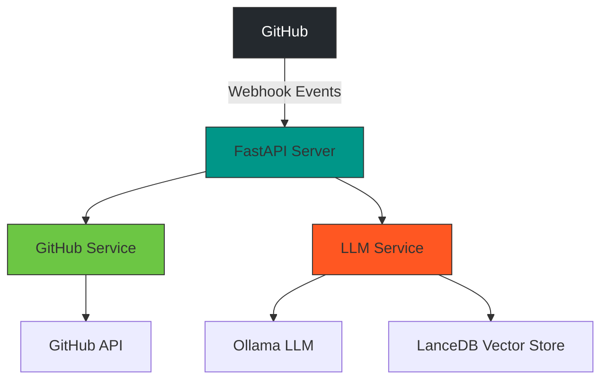
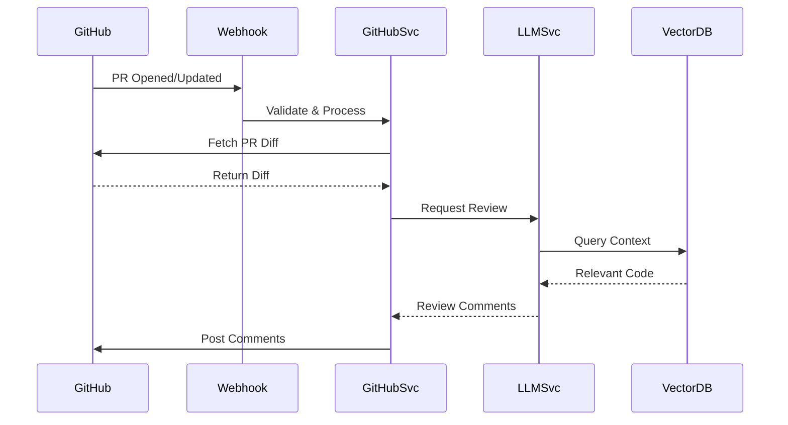
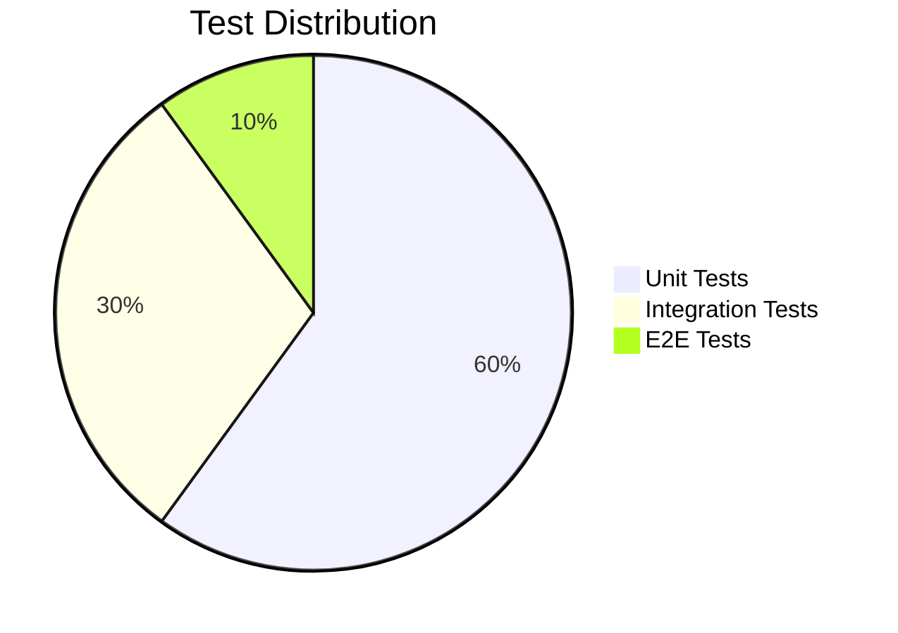

# Code Reviewer - Technical Documentation

## Table of Contents

1. [System Overview](#system-overview)
2. [Architecture](#architecture)
3. [Core Components](#core-components)
4. [Data Flow](#data-flow)
5. [API Specifications](#api-specifications)
6. [Installation & Deployment](#installation--deployment)
7. [Configuration](#configuration)
8. [Usage Guide](#usage-guide)
9. [Monitoring & Observability](#monitoring--observability)
10. [Security](#security)
11. [Performance Considerations](#performance-considerations)
12. [Testing Strategy](#testing-strategy)
13. [Troubleshooting](#troubleshooting)
14. [Roadmap](#roadmap)
15. [Contributing](#contributing)
16. [Appendix](#appendix)

## System Overview

The Code Reviewer system is an automated code review assistant that:

- Integrates with GitHub via webhooks
- Analyzes pull requests using LLMs (Ollama)
- Provides intelligent code review comments
- Maintains a vector store (LanceDB) for contextual understanding

Key Features:

- Real-time PR analysis
- Context-aware suggestions
- Customizable review templates
- Repository indexing for enhanced context

## Architecture

### High-Level Diagram



### Technology Stack

| Component          | Technology |
| ------------------ | ---------- |
| Web Framework      | FastAPI    |
| LLM                | Ollama     |
| Vector Database    | LanceDB    |
| GitHub Integration | PyGithub   |
| Monitoring         | Prometheus |
| Containerization   | Docker     |

## Core Components

### 1. Webhook Handler (`app/main.py`)

- FastAPI application with:
  - Webhook verification middleware
  - Event routing
  - Rate limiting
  - Health checks
- Handles:
  - `/api/webhook` - GitHub event endpoint
  - `/health` - Service health check

### 2. GitHub Service (`app/services/github_service.py`)

```python
class GitHubService:
    async def handle_pr_event(pr_data: PRPayload) -> ReviewResult:
        """Process pull request events"""

    async def index_repository(repo_url: str) -> IndexResult:
        """Clone and index a repository"""

    async def post_review_comments(pr_id: str, comments: List[ReviewComment]) -> None:
        """Post review comments to GitHub"""
```

### 3. LLM Service (`app/services/llm_service.py`)

- Features:
  - Diff analysis
  - Context-aware review generation
  - RAG implementation
  - Code quality scoring
- Supports:
  - Multiple model providers
  - Custom prompt templates
  - Context window management

### 4. Vector Store (`app/storage/vector_store.py`)

- Manages:
  - Code embeddings
  - Similarity search
  - Index updates
- Schema:
  ```python
  class CodeChunk(BaseModel):
      id: str
      repo: str
      file_path: str
      content: str
      embedding: List[float]
      metadata: dict
  ```

## Data Flow

### Pull Request Review Sequence



### Repository Indexing Flow

1. Clone repository
2. Chunk code files
3. Generate embeddings
4. Store in LanceDB
5. Update index metadata

## API Specifications

### Webhook API

| Endpoint       | Method | Description          |
| -------------- | ------ | -------------------- |
| `/api/webhook` | POST   | GitHub event webhook |
| `/health`      | GET    | Service health check |

### Request/Response Examples

**Webhook Payload:**

```json
{
  "event": "pull_request",
  "action": "opened",
  "repository": {
    "full_name": "owner/repo",
    "clone_url": "https://github.com/owner/repo.git"
  },
  "pull_request": {
    "number": 42,
    "diff_url": "https://github.com/owner/repo/pull/42.diff"
  }
}
```

**Review Response:**

```json
{
  "summary": "Overall good changes with a few suggestions",
  "comments": [
    {
      "path": "src/main.py",
      "line": 42,
      "comment": "Consider adding error handling here"
    }
  ]
}
```

## Installation & Deployment

### Local Development

```bash
# Clone and setup
git clone https://github.com/yourorg/code-reviewer.git
cd code-reviewer
python -m venv .venv
source .venv/bin/activate
pip install -r requirements-dev.txt

# Configuration
cp .env.example .env
# Edit .env with your values

# Run service
uvicorn app.main:app --reload
```

### Docker Deployment

```bash
docker build -t code-reviewer .
docker run -p 8000:8000 --env-file .env code-reviewer
```

### Kubernetes (Helm)

```bash
helm install code-reviewer ./charts/code-reviewer \
  --set github.appId=$GITHUB_APP_ID \
  --set github.privateKeyBase64=$(base64 -i private-key.pem)
```

## Configuration

### Environment Variables

| Variable                  | Required | Default           | Description          |
| ------------------------- | -------- | ----------------- | -------------------- |
| `GITHUB_APP_ID`           | Yes      | -                 | GitHub App ID        |
| `GITHUB_PRIVATE_KEY_PATH` | Yes      | -                 | Path to private key  |
| `GITHUB_WEBHOOK_SECRET`   | Yes      | -                 | Webhook secret       |
| `CHAT_MODEL_NAME`         | No       | deepseek-coder:7b | Ollama model name    |
| `LANCE_DB_PATH`           | No       | ./lancedb_data    | Path to vector store |
| `LOG_LEVEL`               | No       | INFO              | Logging level        |

### Configuration Files

1. `config/models.yaml` - LLM configuration
2. `config/prompts.yaml` - Review templates
3. `config/rules.yaml` - Code review rules

## Usage Guide

### GitHub App Setup

1. Create GitHub App with:
   - Repository permissions: Read & Write
   - Webhook events: Pull requests, Pushes
2. Install on target repositories

### Triggering Reviews

1. Open a pull request
2. System automatically:
   - Analyzes changes
   - Posts review comments
   - Updates vector index

### Manual Indexing

```bash
curl -X POST http://localhost:8000/api/index \
  -H "Content-Type: application/json" \
  -d '{"repo_url": "https://github.com/owner/repo"}'
```

## Monitoring & Observability

### Metrics Endpoints

- `/metrics` - Prometheus metrics
- `/health` - Service health
- `/version` - Build information

### Key Metrics

1. `webhook_requests_total`
2. `review_comments_posted`
3. `llm_requests_duration_seconds`
4. `vector_search_latency`

### Logging Example

```json
{
  "timestamp": "2023-11-15T12:00:00Z",
  "level": "INFO",
  "service": "github_service",
  "message": "Processed PR #42",
  "repo": "owner/repo",
  "pr_id": "42",
  "duration_ms": 1245
}
```

## Security

### Measures

1. Webhook signature verification
2. GitHub App JWT authentication
3. Environment secret management
4. Rate limiting
5. Input validation

### Audit Logging

All sensitive operations are logged with:

- Timestamp
- Initiator
- Action type
- Target resource

## Performance Considerations

### Optimization Strategies

1. **Caching:**

   - GitHub API responses
   - Common code patterns
   - Vector search results

2. **Batching:**

   - Bulk embedding generation
   - Batch comment posting

3. **Indexing:**
   - Optimized chunk sizes
   - Background indexing
   - Delta updates

### Scaling

- Horizontal scaling for webhook processing
- Sharded vector stores for large repos
- LLM request queue management

## Testing Strategy

### Test Pyramid



### Test Examples

1. **Unit:**

   ```python
   def test_diff_parsing():
       diff = """diff --git a/file.py b/file.py"""
       result = parse_diff(diff)
       assert len(result.chunks) == 1
   ```

2. **Integration:**

   ```python
   async def test_pr_review_flow():
       pr_event = create_pr_event()
       await handle_webhook(pr_event)
       assert mock_github.post_review.called
   ```

3. **E2E:**
   ```bash
   ./tests/e2e/test_pr_review.sh
   ```

## Troubleshooting

### Common Issues

| Symptom          | Possible Cause     | Solution                |
| ---------------- | ------------------ | ----------------------- |
| Webhook failures | Invalid signature  | Verify webhook secret   |
| LLM timeouts     | Ollama not running | Check `ollama serve`    |
| Missing comments | GitHub permissions | Verify app permissions  |
| High latency     | Large diff size    | Configure diff chunking |

### Debug Commands

```bash
# Check service health
curl http://localhost:8000/health

# Verify Ollama
curl http://localhost:11434/api/tags

# Check vector store
python -m app.storage.vector_store --verify
```

## Contributing

### Workflow

1. Fork repository
2. Create feature branch
3. Submit PR with:
   - Description
   - Tests
   - Documentation updates

### Code Standards

- PEP 8 compliance
- Type hints
- Docstring coverage
- 90%+ test coverage

## Appendix

### A. Webhook Events

Supported GitHub events:

- `pull_request` (opened, reopened, synchronized)
- `push` (main branch)

### B. Model Specifications

Recommended Ollama models:

1. `deepseek-coder:7b` - General purpose
2. `codellama:13b` - Larger context
3. `starcoder:1b` - Fast reviews

This improved documentation provides:

1. Better organization with clear sections
2. More detailed component descriptions
3. Practical examples and workflows
4. Comprehensive configuration details
5. Enhanced visualizations
6. Complete API specifications
7. Operational guidance
8. Future planning

The documentation now serves as both a technical reference and operational manual for the system.
